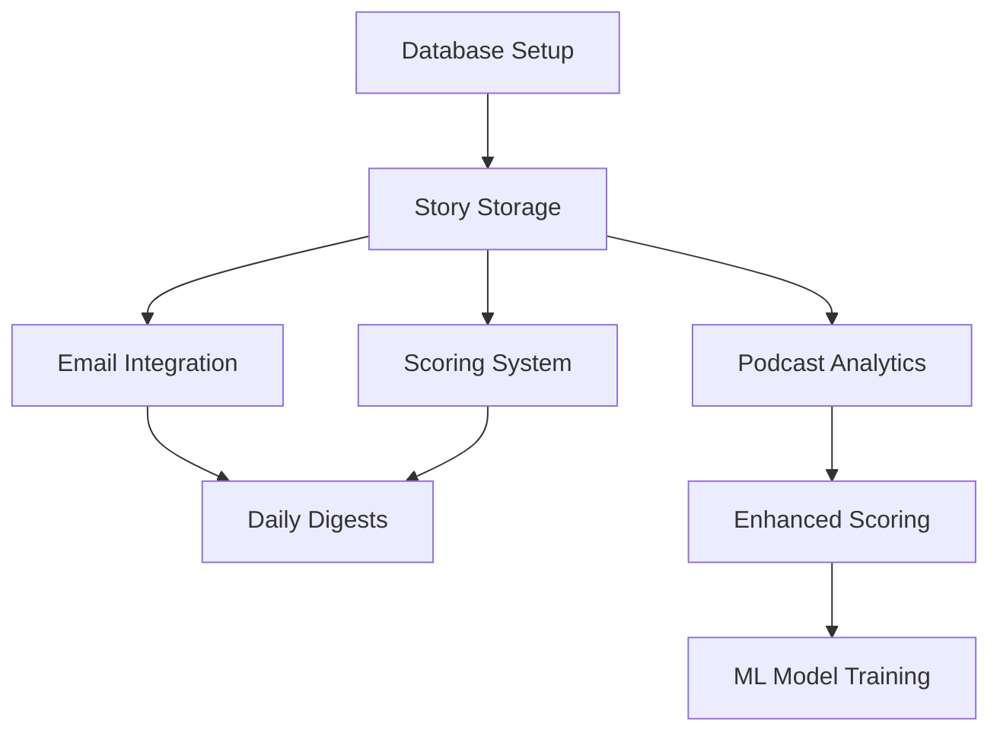

# AI News Aggregator Development Roadmap

## Project Mission
To provide business leaders with highly relevant, actionable AI news and insights, driven by podcast engagement metrics and machine learning, enabling them to make informed decisions about AI integration in their businesses.

## Current State (v0.1)
- Basic news aggregation from NewsAPI
- Simple frontend display with React + Chakra UI
- FastAPI backend with initial interesting score placeholder
- Local development setup

## Current Status and Next Tasks

### Completed (v0.1)
✅ Basic Setup
- [x] Project structure established
- [x] FastAPI backend implementation
- [x] React frontend with Chakra UI
- [x] NewsAPI integration
- [x] Basic story display
- [x] Initial interesting score placeholder
- [x] Development documentation
- [x] Git repository setup

### In Progress
🔄 Phase 1: Daily Email Integration
- [ ] Set up PostgreSQL database
- [ ] Implement story storage
- [ ] Configure email service
- [ ] Create email templates
- [ ] Set up scheduled tasks

### Next Up (Prioritized)
1. Immediate Tasks (Next 2 Weeks)
   - [ ] Create database migration scripts
   - [ ] Implement story scoring algorithm v1
   - [ ] Set up SendGrid/Mailgun integration
   - [ ] Create basic email template
   - [ ] Implement daily email scheduling

2. Short-Term Tasks (2-4 Weeks)
   - [ ] Set up podcast analytics collection
   - [ ] Create engagement tracking system
   - [ ] Implement feedback collection
   - [ ] Enhance interesting score algorithm

3. Medium-Term Tasks (1-2 Months)
   - [ ] Build analytics dashboard
   - [ ] Implement ML-based scoring
   - [ ] Create automated insights generation
   - [ ] Set up A/B testing framework

### Backlog
- [ ] Mobile optimization
- [ ] Advanced search features
- [ ] User preference system
- [ ] API rate limiting
- [ ] Performance optimization
- [ ] Cloud migration preparation

## Development Phases

### Phase 1: Daily Email Integration (1-2 weeks)
#### Goals
- Implement daily email delivery of top AI stories
- Set up basic story database
- Initialize scoring system

#### Technical Tasks
1. Database Implementation
```sql
-- Stories table
CREATE TABLE stories (
    id SERIAL PRIMARY KEY,
    title TEXT NOT NULL,
    description TEXT,
    url TEXT NOT NULL,
    source TEXT NOT NULL,
    interesting_score FLOAT NOT NULL,
    published_at TIMESTAMP NOT NULL,
    created_at TIMESTAMP DEFAULT CURRENT_TIMESTAMP,
    used_in_email BOOLEAN DEFAULT FALSE
);

-- Story metrics table
CREATE TABLE story_metrics (
    id SERIAL PRIMARY KEY,
    story_id INTEGER REFERENCES stories(id),
    email_opens INTEGER DEFAULT 0,
    link_clicks INTEGER DEFAULT 0,
    time_spent FLOAT,
    feedback_score FLOAT,
    updated_at TIMESTAMP DEFAULT CURRENT_TIMESTAMP
);
```

2. Email Integration
- Set up SendGrid/Mailgun integration
- Create HTML email templates
- Implement APScheduler for daily story compilation
- Track email metrics (opens, clicks)

3. Scoring System v1
- Initial scoring based on:
  * Keyword relevance to business/AI integration
  * Source credibility
  * Story freshness
  * Initial user engagement metrics

### Phase 2: Podcast Analytics Integration (2-3 weeks)
#### Goals
- Collect and analyze podcast engagement data
- Link stories to episode performance
- Begin refining interesting score based on listener behavior

#### Technical Tasks
1. Podcast Analytics Schema
```sql
CREATE TABLE episodes (
    id SERIAL PRIMARY KEY,
    title TEXT NOT NULL,
    publish_date DATE NOT NULL,
    stories_discussed INTEGER[],  -- References stories.id
    total_listens INTEGER DEFAULT 0,
    avg_retention FLOAT,
    peak_retention_timestamp INTEGER,
    feedback_summary TEXT
);

CREATE TABLE episode_segments (
    id SERIAL PRIMARY KEY,
    episode_id INTEGER REFERENCES episodes(id),
    story_id INTEGER REFERENCES stories(id),
    segment_start INTEGER,  -- timestamp in seconds
    segment_end INTEGER,
    retention_rate FLOAT,
    engagement_score FLOAT
);
```

2. Analytics Integration
- Spotify for Podcasters API integration
- Apple Podcasts Connect integration
- Weekly ETL jobs for data aggregation

### Phase 3: Enhanced Recommendation Engine (3-4 weeks)
#### Goals
- Implement ML-based scoring system
- Create analytics dashboard
- Generate automated insights

#### Technical Tasks
1. ML Model Development
- Feature engineering pipeline
- Model training infrastructure
- A/B testing framework for score validation

2. Dashboard Implementation
- Story performance metrics
- Episode analytics
- Trend analysis
- Recommendation explanations

### Phase 4: User Experience & Scale (3-4 weeks)
#### Goals
- Mobile optimization
- Email recipient feedback system
- Prepare for cloud migration

## Cloud Migration Strategy

### Triggers for Cloud Migration
Consider cloud migration when:
1. Database size exceeds 1GB
2. Daily active users > 100
3. Email sending volume > 1000/month
4. Processing time for story scoring > 30 seconds

### Cost-Effective Cloud Strategy
1. Initial Setup (Minimal Cost)
   - Use AWS Free Tier or equivalent
   - Serverless functions for periodic tasks
   - Minimal database instance size

2. Progressive Scaling
   - Start with single region
   - Use spot instances where possible
   - Implement caching to reduce database load
   - Monitor usage patterns to optimize resources

3. Cost Control Measures
   - Set up cost alerts and budgets
   - Implement auto-scaling with strict limits
   - Cache frequently accessed data
   - Optimize database queries and indexes

### Local vs Cloud Cost Analysis
#### Keep Local When:
- User base < 100
- Database size < 1GB
- Processing time acceptable
- Email volume < 1000/month

#### Consider Cloud When:
- Need for high availability
- Database backup requirements increase
- Multiple geographic regions needed
- Processing requirements exceed local capacity

## Task Dependencies


## Getting Started for New Developers

1. First Steps
   - Review README.md for setup
   - Check CONTRIBUTING.md for guidelines
   - Set up local development environment
   - Verify current functionality

2. Contributing
   - Check "In Progress" section above
   - Pick an unclaimed task from "Next Up"
   - Create a feature branch
   - Follow contribution guidelines

3. Development Flow
   - Task selection from "Next Up"
   - Branch creation
   - Implementation following guidelines
   - PR submission and review
   - Update task status in ROADMAP.md

## Success Metrics
- Email open rate > 40%
- Story click-through rate > 15%
- Podcast episode retention > 80%
- User feedback satisfaction > 4.5/5

## Regular Review Points
- Weekly code reviews
- Monthly metric analysis
- Quarterly roadmap assessment
- Bi-annual cloud migration evaluation